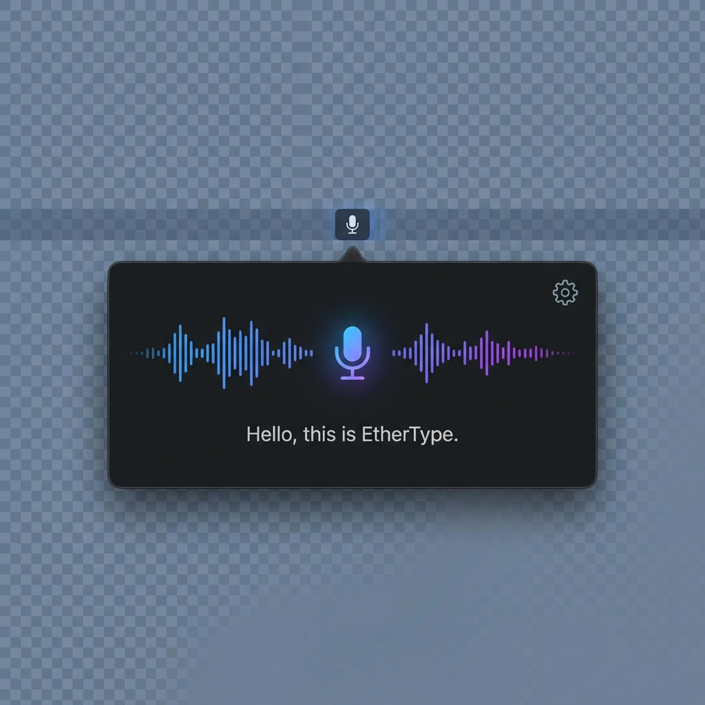

# 🎙️ EtherType

> macOS 原生、极简、本地优先的 AI 语音输入工具

<p align="center">
  
</p>

## ✨ 特性

- **🔒 隐私优先** — 完全本地推理，0% 数据上传
- **⚡ 极速响应** — 基于 Apple Neural Engine 优化
- **🎨 原生体验** — 遵循 macOS Human Interface Guidelines
- **🌍 多语言** — 中/英文自动识别，支持混输
- **🧠 多模型支持** — Small / Large V3 可选，精度与速度自由权衡

## 📦 安装

### 系统要求

- macOS 15.0 (Sequoia) 或更高版本
- Apple Silicon (M1/M2/M3/M4) 推荐

### 下载

从 [Releases](https://github.com/qqyule/EtherType/releases) 页面下载最新版本。

### 从源码构建

```bash
git clone https://github.com/qqyule/EtherType.git
cd EtherType
swift build -c release
```

## 🚀 使用方法

1. 启动 EtherType，应用将常驻菜单栏
2. 首次启动会自动下载 **Small** 语音识别模型（约 500MB）
3. 按住 `Option + Space` 开始录音
4. 松开按键，语音将自动转为文字并输入到当前光标位置

### 自定义快捷键

点击菜单栏图标 → 设置 → 快捷键，录制你喜欢的快捷键组合。

### 切换识别模型

点击菜单栏图标 → 设置 → 模型，选择适合你的模型：

| 模型 | 大小 | 特点 |
|------|------|------|
| **Small** (推荐) | ~500MB | 速度快，适合日常使用 |
| **Large V3** | ~3GB | 精度更高，适合专业场景 |

> 💡 切换模型需要重新下载，请确保网络畅通。

## 🛠️ 技术栈

- **Swift 6.0** + **SwiftUI**
- **[WhisperKit](https://github.com/argmaxinc/WhisperKit)** — 本地语音识别
- **[KeyboardShortcuts](https://github.com/sindresorhus/KeyboardShortcuts)** — 全局快捷键
- **[Defaults](https://github.com/sindresorhus/Defaults)** — 设置存储

## 🗺️ 路线图

- [x] 基础语音转文字
- [x] 全局快捷键
- [x] 多模型支持
- [ ] 开机自启
- [ ] Ollama 后处理集成
- [ ] 自定义提示词

## 📄 License

[MIT License](LICENSE) © 2026 EtherType Contributors
